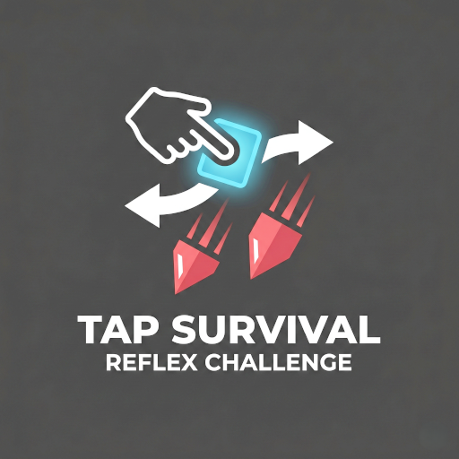

# Tap Survival (Flutter Edition)



**Tap Survival** is a minimalist, fast-paced reflex survival arcade game re-engineered in **Flutter** for butter-smooth 60+ FPS performance, rich visual effects, dynamic synthwave audio, tactile haptics, and deep customization.

---

## 🎮 Gameplay & Features

- **Reflex 2-Lane Switching**: Tap anywhere on the screen to switch lanes and dodge descending hazards.
- **Dynamic Progression**: Difficulty scales continuously with real-time speed ramps and shifting obstacle hazards ("Shifters").
- **Perfect Dodge Bonus**: Switching lanes in close proximity to an obstacle rewards +50 bonus points, tactile haptic feedback, and a visual flare.
- **Power-Up System**:
  - 🛡️ **Shield**: Absorbs a collision with an expanding ripple glow animation.
  - 🧲 **Magnet**: Attracts nearby gems and stars with distance physics for 10 seconds.
  - 👻 **Ghost Mode**: Grants temporary invulnerability with semi-transparency for 10 seconds.
  - 🔥 **Fever Frenzy**: Collect 5 consecutive stars to trigger Fever Mode, converting all obstacles into bonus rewards!
  - 💎 **Gems**: In-game currency for purchasing ammunition and unlocking items in the shop.
- **Ammunition & Shooting**:
  - 🔫 **Bullets** (Unlocked at Level 5): Tap your player avatar twice to shoot and destroy the nearest obstacle in your lane.
  - 🧨 **Screen Clear Bomb** (Unlocked at Level 10): Obliterates all obstacles on screen simultaneously.
- **Deep Customization Shop**:
  - **Player Avatars**: 20 shapes and emojis (Square, Circle, Triangle, Girl, Boy, Rocket, Alien, Robot, Car, Gem, Crown, Cat, Dog, Sun, Lion, Tiger, Panda, Koala, Frog, Octopus).
  - **Player Themes**: Cyan, Ruby, Gold, Purple, White, Neon Green.
  - **Obstacle Shapes**: Square, Circle, Triangle, Hexagon, Diamond, Heart, Pentagon.
  - **Obstacle Colors**: Danger Red, Frost Blue, Acid Green, Void Purple, Sunset.
  - **Environment Skins**: Classic Space, Neon City, Deep Sunset, Digital Rain Matrix.
- **Audio & Haptics**:
  - Retro synthwave BGM with seamless looping.
  - Dedicated sound effects for lane switching, item collection, shield breaks, fever activations, crashes, and level ups.
  - Separate toggles in Settings for Music, SFX, and Vibration.
- **Save & Resume Session**: Automatic session saving when paused or interrupted.

---

## 🛠️ Architecture & Tech Stack

- **Framework**: Flutter 3.44+ / Dart 3.12+
- **Rendering**: Hardware-accelerated `CustomPainter` with Neon Glow shaders, starfield physics, and dynamic trail effects.
- **Audio**: `audioplayers` for low-latency SFX and looping music.
- **Persistence**: `shared_preferences` for progression, high scores, unlockables, and settings.
- **Design System**: Material Design 3 (M3) with custom glassmorphic card overlays.

---

## 🚀 Getting Started

### Prerequisites
- Flutter SDK (v3.44 or newer)
- Android SDK (API 24+) or iOS 12+

### Run Locally
```bash
# Navigate to project directory
cd "Tab Survival"

# Get packages
flutter pub get

# Run on connected device or emulator
flutter run
```

### Build APK
```bash
flutter build apk --release
```

---

## 👨‍💻 Author
- **Developer**: Muhammad Adrees
- **Contact**: +923077377945
